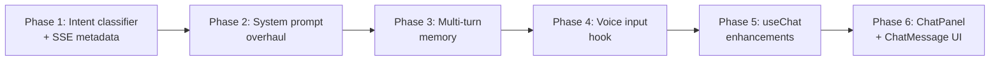

# Modernize PoseCoach Chatbot — Full Modern LLM Experience

The chatbot currently treats **every** user message as a search query: even a simple "hi" gets routed through RAG → web search → Tavily, producing dictionary definitions and irrelevant citations. The root cause is that `_gather_context()` in [chat.py](file:///c:/Users/mashw/OneDrive/Desktop/CollegeMaterials/GYMVISION%20AI/app/api/v1/chat.py) always runs retrieval, and when KB confidence is low it falls back to web search — which dutifully returns results for the literal word "hi".

The fix is a full modernization across **8 feature areas**: intent classification, prompt engineering, multi-turn memory, voice input, rich rendering, feedback, and polish.

---

## User Review Required

> [!IMPORTANT]
> **Voice input uses the Web Speech Recognition API** (browser-native, no external service). Works in Chrome, Edge, Safari — **not Firefox**. Acceptable for an MVP; broader coverage needs a paid STT service.

> [!IMPORTANT]
> **Markdown rendering** — I'll use a lightweight regex-based renderer (zero new deps) for bold, italic, bullets, and inline code. This keeps the bundle lean. If you later want full GFM (tables, code blocks with syntax highlighting), we can swap in `react-markdown`.

> [!WARNING]
> **Multi-turn memory** increases token usage — sending the last 6 messages (3 user + 3 assistant) to the LLM adds ~500–1500 tokens per request. This is standard practice but will increase your Gemini/OpenRouter costs slightly.

---

## Proposed Changes

### Phase 1 — Backend: Intent Classification & Conversational Routing

#### [MODIFY] [chat.py](file:///c:/Users/mashw/OneDrive/Desktop/CollegeMaterials/GYMVISION%20AI/app/api/v1/chat.py)

**Core fix** — detect greetings/small-talk and **skip RAG + web search entirely**:

- Add `_is_conversational(query)` classifier (pattern matching on greetings, thanks, meta-questions)
- When conversational → bypass `_gather_context()`, pass query to LLM with no RAG context, no citations
- Add `source_mode` to SSE metadata event so frontend knows the response type
- Log `source_mode="conversational"` for observability

**Multi-turn memory** — accept a `history` field in the request body:

- `ChatRequest` gains `history: list[dict] | None` — array of `{role, content}` pairs
- Pass history to both `gemini_client.stream_chat()` and `qwen_client.stream_chat()` as prior turns
- Cap at last 6 messages (3 exchanges) to control token usage

**SSE enhancements** — add metadata events:

- `data: {"type": "status", "status": "thinking"}` — emitted before LLM call starts (drives the thinking indicator)
- `data: {"type": "meta", "source_mode": "rag"|"web"|"conversational"}` — tells frontend how the answer was grounded
- Existing token events unchanged: `data: {"token": "...", "done": false}`

---

### Phase 2 — Backend: System Prompt Overhaul

#### [MODIFY] [prompts.py](file:///c:/Users/mashw/OneDrive/Desktop/CollegeMaterials/GYMVISION%20AI/app/chatbot/prompts.py)

Upgrade `SYSTEM_PROMPT` to produce modern LLM-style responses:

- **Follow-up questions**: instruct model to end substantive answers with 1–2 natural follow-up questions
- **Conversational awareness**: greetings get a warm intro + "what are you working on?"
- **Structured formatting**: markdown bold, bullets, short paragraphs
- **Warm personality**: friendly expert, not a rigid FAQ bot

Add a `CONVERSATIONAL_SYSTEM_PROMPT` — lighter variant for small-talk turns (no RAG context instructions, shorter, personality-focused).

Update `build_user_prompt()` to accept optional `history` and format it as a conversation transcript.

---

### Phase 3 — Backend: Multi-turn Support in LLM Clients

#### [MODIFY] [gemini_client.py](file:///c:/Users/mashw/OneDrive/Desktop/CollegeMaterials/GYMVISION%20AI/app/chatbot/gemini_client.py)

- `stream_chat()` gains an optional `history: list[dict]` parameter
- Construct multi-turn `contents` array: system → history turns → current prompt
- Gemini's `generate_content_stream` natively supports multi-turn via its `contents` list

#### [MODIFY] [qwen_client.py](file:///c:/Users/mashw/OneDrive/Desktop/CollegeMaterials/GYMVISION%20AI/app/chatbot/qwen_client.py)

- `_build_messages()` gains an optional `history` parameter
- Insert history messages between system and user message in the OpenAI-format messages array

---

### Phase 4 — Frontend: Voice Input Hook

#### [NEW] [useVoiceInput.ts](file:///c:/Users/mashw/OneDrive/Desktop/CollegeMaterials/GYMVISION%20AI/frontend/src/hooks/useVoiceInput.ts)

New hook wrapping the Web Speech Recognition API:

| Export | Type | Description |
|--------|------|-------------|
| `isSupported` | `boolean` | Browser supports SpeechRecognition |
| `isListening` | `boolean` | Currently recording |
| `transcript` | `string` | Latest recognized text (interim + final) |
| `start()` | `() => void` | Begin listening |
| `stop()` | `() => void` | Stop listening |
| `error` | `string \| null` | Permission denied or recognition error |

- Auto-stops after configurable silence timeout (default 3s)
- `continuous = false` — one utterance per activation (tap-to-talk model)
- Cleans up recognition instance on unmount

---

### Phase 5 — Frontend: Chat Hook Enhancements

#### [MODIFY] [useChat.ts](file:///c:/Users/mashw/OneDrive/Desktop/CollegeMaterials/GYMVISION%20AI/frontend/src/hooks/useChat.ts)

- **Send history**: `send()` now includes the last 6 messages in the POST body
- **Parse new SSE event types**: handle `"status"` and `"meta"` events alongside existing token events
- **New state**: expose `isThinking: boolean` (true between request send and first token received)
- **Regenerate**: add `regenerate()` function that re-sends the last user message
- `ChatMessage` gains optional fields: `sourceMode`, `feedback` (`"up" | "down" | null`)
- Add `setFeedback(messageId, value)` to update feedback on a message

---

### Phase 6 — Frontend: Chat Panel Full Modernization

#### [MODIFY] [ChatPanel.tsx](file:///c:/Users/mashw/OneDrive/Desktop/CollegeMaterials/GYMVISION%20AI/frontend/src/components/ChatPanel.tsx)

This is the biggest change. The panel gets a complete UX overhaul:

**Welcome message + Starter prompts** (empty state):
- When `messages.length === 0`, show a coach avatar + welcome text
- Below it, 3–4 clickable prompt chips:
  - "How deep should I squat?"
  - "Why do my knees cave in?"
  - "What's the ideal bench press grip width?"
  - "Help me fix butt wink"
- Clicking a chip fills the input and auto-submits

**Thinking indicator**:
- When `isThinking` is true (after send, before first token), show a shimmer animation with "Coach is thinking..." text
- Replaces the current 3-dot pulse animation
- Distinct from the streaming state (streaming shows text appearing)

**Rich message rendering** — extract to a new sub-component:

#### [NEW] [ChatMessage.tsx](file:///c:/Users/mashw/OneDrive/Desktop/CollegeMaterials/GYMVISION%20AI/frontend/src/components/ChatMessage.tsx)

Each assistant message bubble includes:

| Feature | Description |
|---------|-------------|
| **Markdown rendering** | Regex-based: `**bold**`, `*italic*`, `- bullets`, `` `code` ``, line breaks |
| **Collapsible sources** | "Sources (3)" toggle that expands to show clickable citation links |
| **Copy button** | Copies the raw text to clipboard (toast notification "Copied!") |
| **Read aloud button** | Uses `SpeechSynthesisUtterance` to TTS the message (reuses pattern from `useCueVoice`) |
| **Thumbs up / down** | Two small icons below the message; clicking one sends feedback (local state for now, POST endpoint later) |
| **Regenerate button** | Only on the last assistant message — calls `regenerate()` from `useChat` |

**Microphone button** in the input bar:
- Mic icon next to Send and + Frame buttons
- Pulsing red ring animation when listening
- Speech fills the text input as interim results arrive
- On final result, user can review + send (no auto-submit — gym is noisy)
- Hidden entirely if `!isSupported`

---

## Summary of All Changes

| Phase | Layer | File | What Changes |
|-------|-------|------|-------------|
| 1 | Backend | `chat.py` | Intent classifier, skip RAG for small-talk, SSE metadata events, accept history |
| 2 | Backend | `prompts.py` | Modern system prompt, follow-up questions, conversational variant, history formatting |
| 3 | Backend | `gemini_client.py` | Accept + format multi-turn history |
| 3 | Backend | `qwen_client.py` | Accept + format multi-turn history |
| 4 | Frontend | `useVoiceInput.ts` | **[NEW]** Web Speech Recognition hook |
| 5 | Frontend | `useChat.ts` | Send history, parse new SSE types, thinking state, regenerate, feedback |
| 6 | Frontend | `ChatMessage.tsx` | **[NEW]** Rich message component: markdown, copy, TTS, feedback, sources |
| 6 | Frontend | `ChatPanel.tsx` | Welcome message, starter prompts, mic button, thinking indicator, full UX overhaul |

---

## Implementation Order



Backend first (Phases 1–3), then frontend (Phases 4–6). Each phase is independently testable.

---

## Verification Plan

### Automated Tests
```bash
# Backend unit tests
cd "c:\Users\mashw\OneDrive\Desktop\CollegeMaterials\GYMVISION AI"
python -m pytest tests/ -k chat -v

# Frontend type check
cd frontend
npx tsc --noEmit
```

### Manual Verification
| Test Case | Expected Result |
|-----------|----------------|
| Send "hi" | Warm greeting, **no** dictionary sources, no citations |
| Send "how do I fix butt wink?" | RAG-grounded answer with follow-up questions + collapsible sources |
| Send "thanks" | Friendly sign-off, no web search triggered |
| Open chat panel (empty) | Welcome message + 4 clickable starter prompts |
| Click starter prompt | Auto-fills input and submits |
| Check thinking state | "Coach is thinking..." shimmer before first token |
| Mic button in Chrome | Speech fills input, pulsing animation while listening |
| Mic button in Firefox | Button hidden (not supported) |
| Copy button | Message text copied to clipboard |
| Read aloud button | TTS speaks the message |
| Thumbs up/down | Icon highlights on click, stores feedback locally |
| Regenerate | Last assistant message replaced with fresh LLM response |
| Multi-turn: "what about bench?" after squat question | LLM references the previous squat context |
